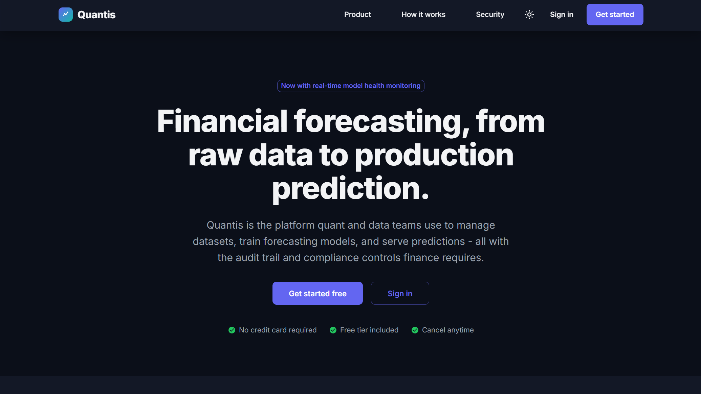

# Quantis


## Quantitative Trading and Investment Analytics Platform

Quantis is a financial forecasting and ML platform: a FastAPI backend for auth, datasets, models, predictions, notifications, monitoring, financial calculations, and real-time WebSocket updates, paired with a React web dashboard and a React Native (Expo, TypeScript) mobile app. A separate quantitative research library (`code/quant_ml`) covers alpha signals, portfolio optimization, regime detection, and a PyTorch-based forecasting model with real MLflow experiment tracking; the live backend's own test suite exercises it, but the running API doesn't import it.

<div align="center">
  
</div>

## Table of Contents

- [Overview](#overview)
- [Project Structure](#project-structure)
- [Feature Status](#feature-status)
- [Technology Stack](#technology-stack)
- [Architecture](#architecture)
- [Installation and Setup](#installation-and-setup)
- [Running the Stack](#running-the-stack)
- [API Surface](#api-surface)
- [Testing](#testing)
- [CI/CD Pipeline](#cicd-pipeline)
- [Documentation](#documentation)
- [Contributing](#contributing)
- [License](#license)

## Overview

Quantis demonstrates a financial forecasting workflow across a real, runnable codebase. The FastAPI backend and both clients are wired and covered by tests. As shipped, the backend runs on SQLite by default (a live `quantis.db` file, with its write-ahead-log files, is checked into the repository); Docker Compose provisions a MySQL 8.0 container, but no MySQL driver is listed in `requirements.txt`, so the app can't actually connect to it without adding one.

## Project Structure

```
Quantis/
├── code/
│   ├── backend/                # FastAPI application
│   │   ├── core/app.py         # App setup and router registration
│   │   ├── endpoints/          # auth, users, datasets, models, prediction,
│   │   │                       # notifications, monitoring, financial, websocket
│   │   ├── domain/             # Domain logic
│   │   ├── services/           # Business logic backing the endpoints
│   │   ├── workers/            # Celery task definitions
│   │   ├── auth/               # JWT and MFA logic
│   │   └── tests/              # Backend test suite (also exercises code/quant_ml)
│   └── quant_ml/               # Quantitative research library (not imported by
│       │                       # the live API; exercised only by backend tests)
│       ├── quant/              # alpha_signals, portfolio_optimizer, regime_detection,
│       │                       # risk_metrics, execution_model, backtester
│       └── models/             # train_model.py (PyTorch), mlflow_tracking.py,
│                               # aws_deploy.py (optional SageMaker deployment)
├── web-frontend/               # React (Vite) dashboard
├── mobile-frontend/            # React Native (Expo) app, TypeScript
├── infrastructure/             # Docker, Kubernetes, Terraform, Ansible, monitoring
├── scripts/                    # Setup, run, test, lint, and build scripts
├── docs/                       # Documentation (this directory)
└── README.md
```

## Feature Status

### Application tier (wired and tested)

| Component                  | Details                                                                                                                                                                                                                                                     |
| :------------------------- | :---------------------------------------------------------------------------------------------------------------------------------------------------------------------------------------------------------------------------------------------------------- |
| **API**                    | FastAPI backend exposing `/auth`, `/users`, `/datasets`, `/models`, `/predictions`, `/notifications`, `/monitoring`, `/financial`, and `/ws`.                                                                                                               |
| **Auth**                   | JWT sessions, MFA setup/enable/disable, and API key management. `secret_key` defaults to a static placeholder ("dev-key-change-in-prod") with no check that rejects it in production.                                                                       |
| **Real-time updates**      | A genuine WebSocket connection manager (`endpoints/websocket.py`) for pushing updates to connected users, not a placeholder.                                                                                                                                |
| **Financial calculations** | Interest and NPV calculation endpoints, plus a transaction workflow with approve/reject actions and configurable compliance limits.                                                                                                                         |
| **Background tasks**       | Celery workers, backed by Redis.                                                                                                                                                                                                                            |
| **Data layer**             | SQLite by default (`sqlite:///./quantis.db`); no PostgreSQL or MySQL driver is installed, so the MySQL container in Docker Compose isn't reachable from the app as shipped.                                                                                 |
| **Production container**   | `infrastructure/Dockerfile.api` starts gunicorn with `app.main:app`, but there is no `app/main.py` (or `api/app.py`) anywhere in the codebase; the real FastAPI instance is `core.app:app`. As currently written, the production image would fail to start. |
| **Experiment tracking**    | Genuine MLflow integration (`mlflow.start_run`, `log_params`, `log_metrics`, `log_artifact`) in `quant_ml/models/mlflow_tracking.py`, with its own MLflow container in Docker Compose.                                                                      |
| **Web dashboard**          | React app (plain JavaScript, Vite) with Material-UI and Recharts, covering datasets, models, predictions, financial, monitoring, and authentication screens.                                                                                                |
| **Mobile app**             | React Native (Expo) app in TypeScript, covering the equivalent core screens.                                                                                                                                                                                |

### Research tier (library, exercised by tests, not called by the live API)

| Component                             | Details                                                                                                                                                                                  |
| :------------------------------------ | :--------------------------------------------------------------------------------------------------------------------------------------------------------------------------------------- |
| **Forecasting model**                 | A PyTorch model trained by `quant_ml/models/train_model.py`, evaluated with scikit-learn metrics.                                                                                        |
| **Quant research modules**            | Alpha signal generation, portfolio optimization, regime detection, risk metrics, an execution model, and a backtester, all in `quant_ml/quant`. None of these have their own test files. |
| **Optional AWS SageMaker deployment** | `quant_ml/models/aws_deploy.py` can deploy a trained model to SageMaker, but only if the `sagemaker` package is installed separately; it isn't a default dependency.                     |

Only the backend's own test files (`test_forecasting_model.py`, `test_model.py`, `test_infrastructure.py`) import anything from `code/quant_ml`; the running FastAPI application does not.

## Technology Stack

| Area                 | Technology                                                               |
| :------------------- | :----------------------------------------------------------------------- |
| Backend API          | Python 3.11+, FastAPI, Uvicorn, Pydantic v2                              |
| Auth                 | PyJWT, an in-house MFA module                                            |
| Data layer           | SQLAlchemy 2, SQLite by default                                          |
| Background tasks     | Celery, Redis                                                            |
| Quant / ML (library) | PyTorch, scikit-learn, MLflow, pandas, optional AWS SageMaker deployment |
| Web frontend         | React 18, JavaScript, Vite, Material-UI, Recharts, axios                 |
| Mobile frontend      | React Native, Expo, TypeScript                                           |
| Infrastructure       | Docker, Docker Compose, Kubernetes, Terraform, Ansible                   |
| Monitoring           | Prometheus, Grafana, Alertmanager, node-exporter, cAdvisor               |
| CI/CD                | GitHub Actions                                                           |
| Testing              | pytest (backend), Vitest (web), Jest (mobile)                            |

## Architecture

```
Clients
  ├── web-frontend (React)               ── HTTP/WebSocket ──┐
  └── mobile-frontend (React Native)     ── HTTP/WebSocket ──┤
                                                             ▼
Backend (FastAPI)
  ├── Endpoints   auth, users, datasets, models, predictions,
  │               notifications, monitoring, financial, ws
  ├── Services     business logic backing each endpoint group
  ├── Workers       Celery tasks (Redis-backed)
  └── Data layer      SQLite (SQLAlchemy)

Research library (code/quant_ml, not called by the live API)
  quant (alpha signals, portfolio optimization, regime detection,
  risk metrics, execution model, backtester)
  models (PyTorch training, MLflow tracking, optional SageMaker deployment)
```

See [docs/ARCHITECTURE.md](docs/ARCHITECTURE.md) for detail.

## Installation and Setup

Prerequisites: Python 3.9+ and Node.js 16+.

```bash
git clone https://github.com/quantsingularity/Quantis.git
cd Quantis

# Backend (also installs quant_ml's dependencies)
cd code/backend
python -m venv .venv && source .venv/bin/activate
pip install -r requirements.txt

# Web frontend
cd ../../web-frontend
npm install

# Mobile frontend
cd ../mobile-frontend
npm install
```

For an automated setup:

```bash
git clone https://github.com/quantsingularity/Quantis.git
cd Quantis
./scripts/setup_quantis_env.sh
./scripts/run_quantis.sh
```

Full, environment-specific instructions are in [docs/INSTALLATION.md](docs/INSTALLATION.md).

## Running the Stack

```bash
# 1) Supporting services, including MySQL (unreachable without adding a driver;
#    the app itself will fall back to SQLite), Redis, and MLflow (from
#    infrastructure/, Docker required)
docker compose up -d redis mlflow

# 2) Backend (from code/backend, venv active)
uvicorn core.app:app --reload      # serves http://0.0.0.0:8000, docs at /docs

# 3) Web dashboard (from web-frontend)
npm run dev

# 4) Mobile app (from mobile-frontend)
npm start
```

**Access points:** Web dashboard at `http://localhost:3000`, API docs at `http://localhost:8000/docs`.

See [docs/USAGE.md](docs/USAGE.md) and [docs/CONFIGURATION.md](docs/CONFIGURATION.md).

## API Surface

Base URL `http://localhost:8000`. Interactive docs at `/docs` (Swagger) and `/redoc`.

| Group         | Prefix           | Highlights                                                                                              |
| :------------ | :--------------- | :------------------------------------------------------------------------------------------------------ |
| Auth          | `/auth`          | `login`, `refresh`, `logout`, `me`, `mfa/setup`, `mfa/enable`, `api-keys`                               |
| Users         | `/users`         | list, `roles`, `permissions`, `{user_id}`                                                               |
| Datasets      | `/datasets`      | upload, list, `{dataset_id}`, `{dataset_id}/stats`, `{dataset_id}/preview`, `{dataset_id}/download`     |
| Models        | `/models`        | list/create, `compare`, `types`, `{model_id}`, `{model_id}/train`, `{model_id}/metrics`                 |
| Predictions   | `/predictions`   | `predict`, `predict/batch`, `predictions/history`, `predictions/stats`                                  |
| Notifications | `/notifications` | list, `{id}/read`, `mark-all-read`                                                                      |
| Monitoring    | `/monitoring`    | `health`, `stats`, `audit-logs`, `metrics`, `analytics/predictions`, `maintenance/cleanup`              |
| Financial     | `/financial`     | `transactions`, `transactions/{id}/approve`, `financial-summary`, `calculate-interest`, `calculate-npv` |
| WebSocket     | `/ws`            | Real-time connection endpoint                                                                           |

Full request and response shapes are in [docs/API.md](docs/API.md).

## Testing

```bash
# Backend, from code/backend (also runs the quant_ml tests that live here)
pytest

# Web (from web-frontend)
npm test

# Mobile (from mobile-frontend)
npm test
```

The backend suite has 9 test files, including coverage of the `quant_ml` forecasting model. The web dashboard has 5 test files (Vitest); the mobile app has 3 (Jest). There is no dedicated test suite inside `code/quant_ml` itself.

## CI/CD Pipeline

GitHub Actions (`.github/workflows/cicd.yml`) runs three jobs on push, pull request, and manual dispatch:

| Job                 | Depends on          | What it does                                                                       |
| :------------------ | :------------------ | :--------------------------------------------------------------------------------- |
| Code Quality Checks | -                   | Python formatter checks (autoflake, black) and a repository-wide Prettier check    |
| Backend Tests       | Code Quality Checks | Runs the pytest suite with coverage and uploads the coverage report as an artifact |
| Frontend Build      | Code Quality Checks | Installs dependencies and produces the production web build (no test step)         |

There is currently no CI job for the mobile app.

## Documentation

| Document                                           | Contents                               |
| :------------------------------------------------- | :------------------------------------- |
| [docs/README.md](docs/README.md)                   | Documentation index                    |
| [docs/ARCHITECTURE.md](docs/ARCHITECTURE.md)       | System architecture                    |
| [docs/API.md](docs/API.md)                         | REST API reference                     |
| [docs/INSTALLATION.md](docs/INSTALLATION.md)       | Setup for all components               |
| [docs/CONFIGURATION.md](docs/CONFIGURATION.md)     | Environment variables and config       |
| [docs/USAGE.md](docs/USAGE.md)                     | Running and using the platform         |
| [docs/CLI.md](docs/CLI.md)                         | Helper scripts reference               |
| [docs/FEATURE_MATRIX.md](docs/FEATURE_MATRIX.md)   | Feature status, implemented vs planned |
| [docs/TROUBLESHOOTING.md](docs/TROUBLESHOOTING.md) | Common issues and fixes                |
| [docs/CONTRIBUTING.md](docs/CONTRIBUTING.md)       | Contribution guide                     |
| [docs/examples/](docs/examples/)                   | Worked examples                        |

## Contributing

See [docs/CONTRIBUTING.md](docs/CONTRIBUTING.md).

## License

This project is licensed under the MIT License - see the [LICENSE](LICENSE) file for details.
